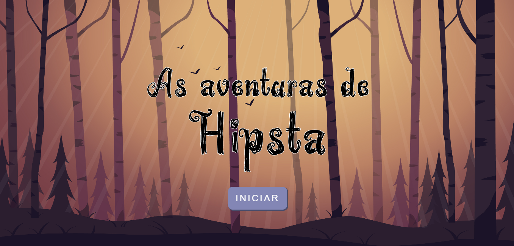
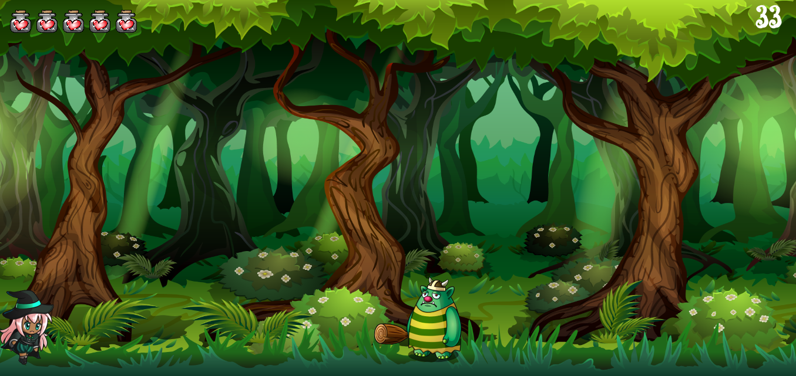
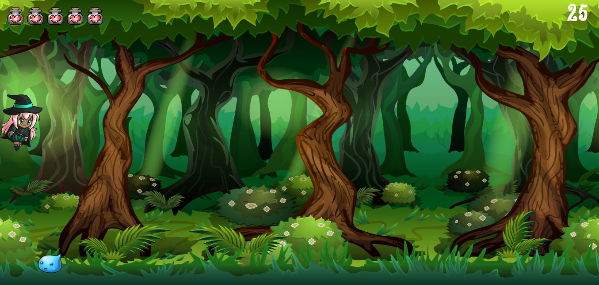

<h1 align="center">
  
</h1>

<h2 align="center">As aventuras de Hipsta</h2>
<p> 
  <strong>As aventuras de Hipsta</strong> é um game no estilo Endless Runner desenvolvido em Javascript para praticar a linguagem. A bruxa Hipsta deve pular seus inimigos na floresta para não perder vidas.
  
  O Projeto foi desenvolvido durante o bootcamp <strong>Imersão GameDev</strong> da [Alura](https://www.alura.com.br/).
</p>

## :dart: Índice
- [Status](#status)
- [Layout](#layout)
- [Tecnologias](#tecnologias)
- [Pré-Requisitos](#pre-requisitos)
- [Executando o projeto](#executando-o-projeto)
- [Licença](#licença)

## :game_die: Status
<p align="center">
  
  
  
  
</p>

## :framed_picture: Layout




## :toolbox: Tecnologias
- [Javascript](https://javascript.com/)

## :heavy_check_mark: Pré-requisitos
Antes de iniciar, certifique-se que tenha instalado em seu computador um servidor local para que o jogo possa rodar em seu navegador. 
Caso não possua, uma forma simples de resolver é instalando a extensão abaixo para o Chrome:

- [Web Server](https://chrome.google.com/webstore/detail/web-server-for-chrome/ofhbbkphhbklhfoeikjpcbhemlocgigb)

## :gear: Executando o projeto

1. *Faça um clone do repositório:*

```sh
$ git clone https://github.com/LuizEduardoBilotta/ImersaoGameDev.git
```

2. *Abra o Chrome e siga as etapas abaixo:*

- Digite `chrome://apps` na barra de endereços do seu navegador.

- Clique na extensão `Web Server`, uma janela se abrirá.

- A opção `Web Server`deverá estar habilitada para `STARTED`. 

- Clique em `CHOOSE FOLDER` e selecione a pasta do projeto.

- Em seguida, em `Web Server URL(s)` clique em `http://127.0.0.1:8887`.

- Uma nova guia do navegador deverá abrir com a tela inicial do jogo. 

**OBS:** Caso não inicie a aplicação automaticamente em seu navegador, acesse manualmente digitando na barra de endereços: `127.0.0.1:8887`

## :bookmark_tabs: Licença
Este projeto está licenciado nos termos da licença MIT. Veja o arquivo [LICENSE](./LICENSE) para mais detalhes.

## :jigsaw: Contato
- :mailbox_with_mail: E-mail: <a href="mailto:luizeduardobilotta@gmail.com">luizeduardobilotta@gmail.com</a>
- :pushpin: Linkedin: [in/luizeduardobilotta](https://www.linkedin.com/in/luizeduardobilotta)

<sup>Desenvolvido por <i><strong>Luiz Eduardo Bilotta.</i></strong></sup>
